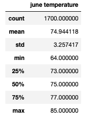
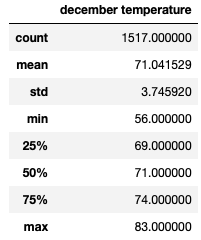

# Module 9: Surfs_up

## Overview of Project
Using Python, SQlLite, & SQLAlchemy

### Purpose
A potential investor in your Surf Shop/Ice Cream store wants more information about temperature trends before opening the surf shop. Specifically, he wants temperature data for the months of June and December in Oahu, in order to determine if the surf and ice cream shop business is sustainable year-round.  Deliverables include
* Determine the Summary Statistics for June
* Determine the Summary Statistics for December
* Submit a written report for the statistical analysis
 
## Results (Three Key Differences Between June and December)

 

#### Summary PyBer Data by City Type

### Differences in Total Rides
* Urban cities had the highest number of rides (1625).
* Per the summary chart above, the total rides decreased from Urban to Suburban by 1000 rides, and by 1500 comparing Urban to Rural.

### Differences in Total Drivers (Reference Chart Above)
* Urban cities had the highest number of drivers (2405).
* The number of drivers decreased significantly as you went from Suburban down to Rural cities.

### Differences in Total Fares (Reference Chart Above)
* Urban cities had the largest amount of total fares ($39,854.38)
* As would be expected, the total fares decreased as well from Urban to Suburban to Rural cities

### Differences in Average Fare per Ride and Driver (Reference Chart Above)
* Urban cities had the lowest Average fare both per Ride ($24.53) and per Driver ($16.57).
* Average fares per ride and per driver increased moving from Urban to Suburban to Rural cities

### Differences in Total Fare by City Type (Reference Line Graphs & Chart Below)
* As expected, based on the information above, Urban cities consistently had the highest total fare dollars.
* Suburban cities had the second highest total fare dollars.
* Rural cities had the least total fare dollars.

#### PyBer Fare Summary by City Type (Jan. 1, 2019 to April 28, 2019)
#### (Note: 2nd image shows greater date detail)
   

#### Data Behind the Two Graphs Above

## Summary: 
Three business recommendations to the CEO for addressing any disparities among the city types:
1. Focus on increasing rides in suburban and rural cities.  You may consider reducing the fares in these cities to attract more riders
2. Focus on increasing the number of drivers to facilitate additional riders.
3. Consider marketing during winter months in rural areas where road closers due to snow and ice may be more common.
4. Consider marketing special ride deals to/from suburan and urban cities for work commutes and weekend events to eliminate parking issues and prevent drunk driving.

